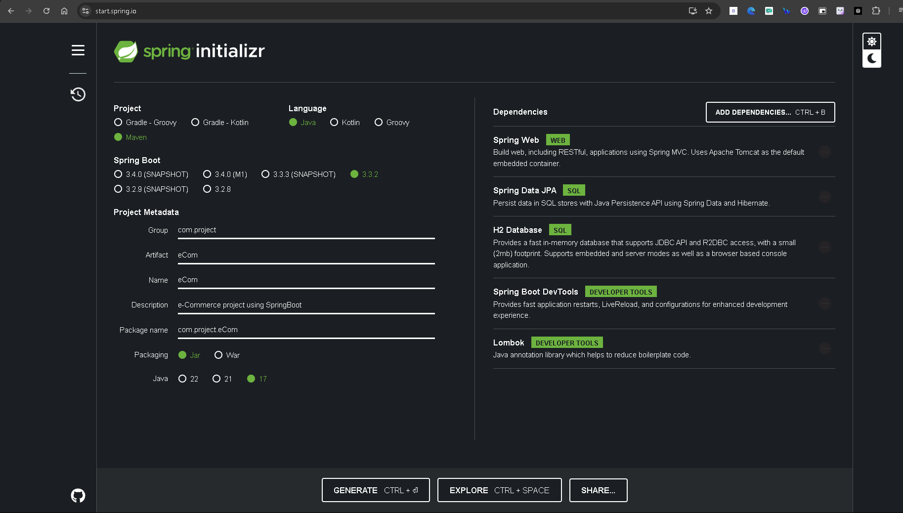

eCom_FrontEnd - UI project based on React+Vite
ecom_BackEnd - Backend project based on Spring Boot


1. Spring Boot project setup
   

2. Front End
   ```text
   npm i
   npm run dev
   ```

3. H2 DB setup
   ```text
   spring.datasource.url=jdbc:h2:mem:eCom
   spring.datasource.driverClassName=org.h2.Driver
   ```

   To show the query in console:
   ```
   spring.jpa.show-sql=true
   ```
   
   To not create DB everytime the server is started, instead to update the same DB that was created 1st time
   ```text
   spring.jpa.hibernate.ddl-auto=update
   ```
   
   To auto generate id for the rows of data added in the table
   ```text
   @GeneratedValue(strategy = GenerationType.IDENTITY)
   ```

   When server is restarted the data in db will be erased, so to load dummy data in H2 DB create a file data.sql in resources
   But the problem with this arises post spring 2.7 that program will try to load data even before the table is created.
   To solve this add a property to delay the data initialization, that is data will be added after table is created
   ```text
   spring.jpa.defer-datasource-initialization=true
   ```
   
   **CORS policy: No 'Access-Control-Allow-Origin' header is present on the requested resource**
   The above error will rise when frontend is trying to get data from the backend api by is not allowed because of security reasons as both are running on different ports(addresses)
   To solve this use **@CrossOrigin** annotation for the controller (below @RestController)

   To change the date format, Jackson library can be used, it not only converts objects to JSON and vice versa and also can change formats
   This can be achieved using JSONFormat which will take the input type and then the pattern to which it has to be modified
   ```text
   @JsonFormat(shape = JsonFormat.Shape.STRING, pattern = "dd-MM-yyyy")
   ```
   
   To return the status code with the response body, this can be achieved using ResponseEntity
   ```java
   //Before
   @GetMapping("/products")
   public List<Product> getAllProducts(){
      return service.getAllProducts();
   }
   
   //After
   @GetMapping("/products")
   public ResponseEntity<<List<Product>> getAllProducts(){
      return new ResponseEntity<>(service.getAllProducts(), HttpStatus.OK);
   }
   ```
   
   To store image, in backend byte array can be used and it needs to be stored as large object so use @Lob
   
   @RequestBody accepts whole JSON as object
   @RequestPart will accept request in part

   Image will be of type multipartFile

   JpaRepository only supports CRUD operations, to search by text we can write a customizable query not sql query
   that is JPQL - JPA Query Language
   In sql we have table, here it is className, and instead of column names use field names
   Query will be mentioned in @Query
   ```java
   @Query("SELECT p from Product p WHERE "+
      "LOWER(p.name) LIKE LOWER('% :keyword %')")
   // here wer aer concating keyword with %, this can be achieved using concat instead of hard coding
   @Query("SELECT p from Product p WHERE "+
      "LOWER(p.name) LIKE LOWER(CONCAT('%', :keyword, '%'))")
   //below is the complete query
   @Query("SELECT p from Product p WHERE " +
      "LOWER(p.name) LIKE LOWER(CONCAT('%', :keyword, '%')) OR " +
      "LOWER(p.description) LIKE LOWER(CONCAT('%', :keyword, '%')) OR " +
      "LOWER(p.brand) LIKE LOWER(CONCAT('%', :keyword, '%')) OR " +
      "LOWER(p.category) LIKE LOWER(CONCAT('%', :keyword, '%'))")
   ```